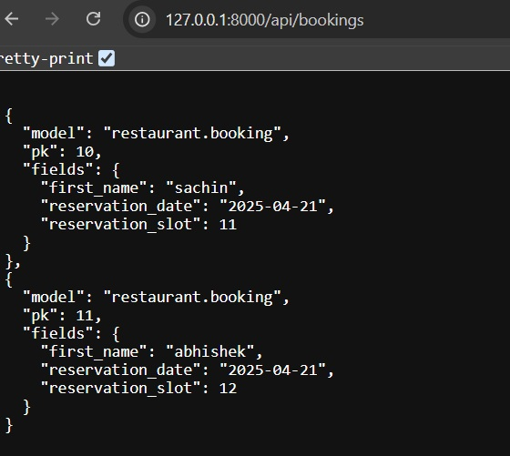

## Coursera/ Meta Backend Developer CapStone/ Module 4/ Assignment


# 🍋 Little Lemon Restaurant FullWeb-Application with API integeration.
▷ This is the Peer graded assignment of the Coursra Meta Backend Developer Capstone

🚀 Project Overview

This project simulates the back-end infrastructure of a restaurant called Little Lemon, focusing on robust API development, database integration, user authentication, and booking systems.
By building this from the ground up, I’ve applied industry best practices and sharpened my ability to craft production-ready APIs for real-world applications.
Throughout this journey, I've explored core back-end principles such as:

🔧 API Design & RESTful routing
🧩 Database modeling with Django ORM
🔐 Token-based Authentication & Authorization
🛠️ Unit Testing and Validation
🚦 Role-based access control for enhanced security


Thanks for taking the time to review this project! My hope is that it sparks inspiration and provides helpful guidance for other aspiring back-end developers as they navigate their own paths in the exciting world of software development.
## Steps to Run Project:-
1. 🧬 Clone the Repository

2. 📦 Install Dependencies using pipfile.lock
pipenv install

3. 🐚 Activate the Virtual Environment
pipenv shell

4. 🧠 Select the Python Interpreter in VS Code
Press CTRL + SHIFT + P
Search for Python: Select Interpreter
Choose the one that corresponds to your .venv or pipenv environment

5. 🔧 Make Migrations
python manage.py makemigrations

6. 📥 Apply Migrations
python manage.py migrate

7. 👤 Create a Superuser

python manage.py createsuperuser

8. 🛢️ Configure MySQL (Optional)
If you're using MySQL, update the DATABASES section in settings.py:

python
Copy code
DATABASES = {
    'default': {
        'ENGINE': 'django.db.backends.mysql',
        'NAME': 'reservations',
        'HOST' : '127.0.0.1',
        'PORT' : '3306',
        'USER' : 'root',
        'PASSWORD' : 'mysql_password',
    }
}
Ensure you have mysqlclient installed and MySQL running.

9. 🧭 Access Django Admin
Go to:http://127.0.0.1:8000/admin
Login using your superuser credentials.
View and manage models like MenuItem, Booking,Users, Tokens...

Manage users and tokens

11. 🚀 Run the Server
python manage.py runserver

12. 🔗 Explore the API Endpoints
All API routes are defined in app-level urls.py files

Test endpoints using desktop tool like 'Insomnia', or your browser

## 📚 Content Guide

▷ Feel free to navigate using the content outline on the top-right corner of the page for quick access to each section.

## 🔄 API User Registration and Authentication

▷ The API app comes with a total of 5 endpoints, plus you'll find Djoser endpoints ready to use as well.


- Check out all Bookings using endpoint-
```
http://127.0.0.1:8000/api/bookings/
```

| Method | Action                  | TOKEN AUTH | STATUS CODE |
|--------|-------------------------|------------|-------------|
| GET    | Retrieve all Bookings | No         | 200  OK       |

- Check or add Menu List-
```
http://127.0.0.1:8000/api/menu/
```

| Method | Action                      | TOKEN AUTH | STATUS CODE |
|--------|-----------------------------|------------|-------------|
| GET    | Retrieve all Bookings       | No         | 200  OK     |
| POST   | Add Menu using Api endpoint | No         | 200  OK     |


- Check out all the menu items-
```
http://127.0.0.1:8000/api/menu-items
```

| Method | Action                  | TOKEN AUTH | STATUS CODE |
|--------|-------------------------|------------|-------------|
| GET    | Retrieve all menu items | No         | 200  OK       |


- Discover, update, partially modify, or bid farewell to that special dish
```
http://127.0.0.1:8000/api/menu-items/{itemId}
```

| Method | Action                           | TOKEN AUTH | STATUS CODE |
|--------|----------------------------------|------------|-------------|
| GET    | Retrieves the menu item details  | No         | 200  OK     |


- Explore, special Table:-
```
http://127.0.0.1:8000/api/cart/menu-items
```

| Method | Action                 | TOKEN AUTH | STATUS CODE |
|--------|------------------------|------------|-------------|
| GET    | Retrieve all bookings  | Yes        | 200         |


- Check it out, update, partially modify, or bid farewell to that one special table
```
http://127.0.0.1:8000/api/bookings
```

| Method | Action                        | TOKEN AUTH | STATUS CODE |
|--------|-------------------------------|------------|-------------|
| GET    | Retrieve the booking details  | Yes        | 200         |
| POST   | Update the booking            | Yes        | 200         |


- User Registration:-
```
http://127.0.0.1:8000/api/users
```

| Method | Action                        | TOKEN AUTH | STATUS CODE |
|--------|-------------------------------|------------|-------------|
| POST   | Register the user             |    No      | 200         |

- Get Token Api Key:-
```
http://127.0.0.1:8000/api/auth/token
```

| Method | Action                        |    Json    | STATUS CODE |
|--------|-------------------------------|------------|-------------|
| GET    | Generate the Api Token        |    Yes     | 200         |

- Add User to Manager:-
```
http://127.0.0.1:8000/groups/manager/users
```

| Method | Action                        |TOKEN AUTH/JSON | STATUS CODE |
|--------|-------------------------------|----------------|-------------|
| GET    | Add User to Manager group     |    Yes         | 200         |


## Peer review 🧐

▷ I've got a couple of folks looking over my code, and before they grade it, they're checking out things like:

- Does the web application use Django to serve static HTML content?
- Has the learner committed the project to a Git repository?
- Does the application connect the backend to a MySQL database?
- Are the menu and table booking APIs implemented?
- Is the application set up with user registration and authentication?
- Does the application contain unit tests?
- Can the API be tested with the Insomnia REST client?


## Little Lemon Restaurant Table Bookings
```
http://127.0.0.1:8000/home/
```

1. To Book the Table, Go Book The Table button
```
http://127.0.0.1:8000/
```

Follow the prompts to select your desired date and time for the reservation.

2. to book the slot:-
```
http://127.0.0.1:8000/book/
```

Follow the instructions to enter your details and confirm the booking.
a. Enter Name
b. Select Reservation Date
c. Select Reservation Time

d.Click on Reserve Now


3. To check Reservations, go to Revervations nav bar
```
http://127.0.0.1:8000/reservations/
```
returns All Bookings in JSon Format.

